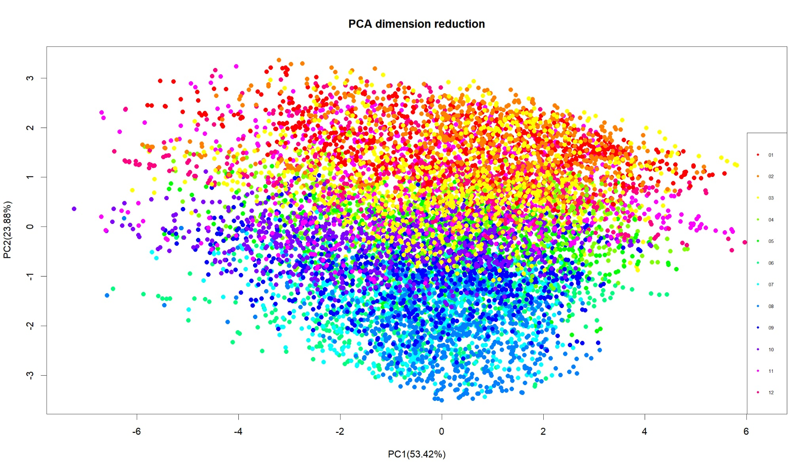
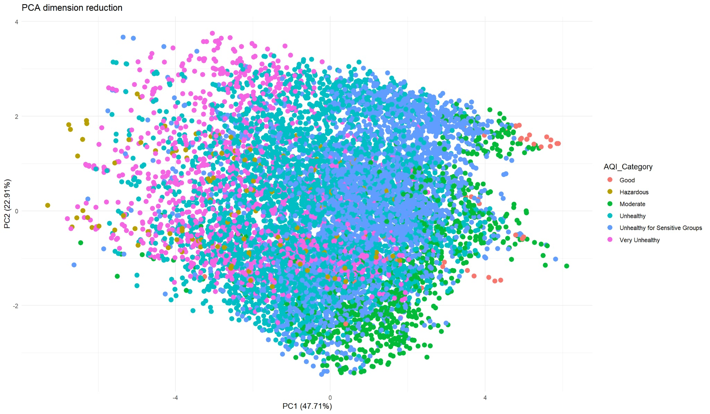
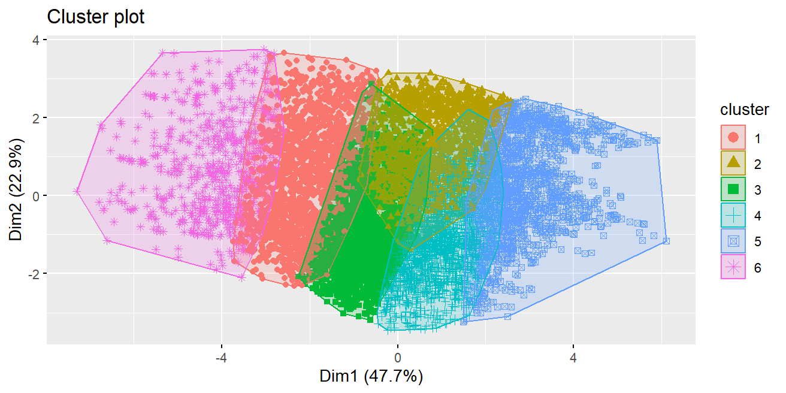
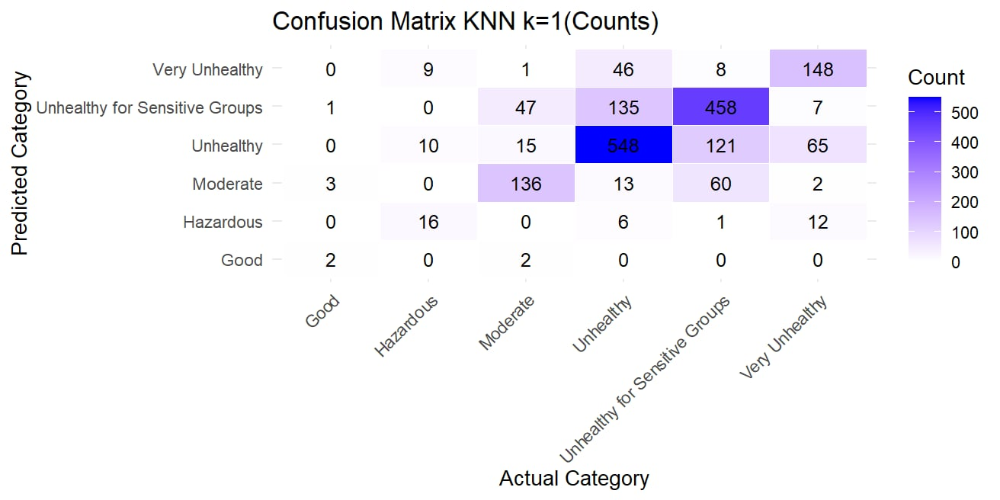
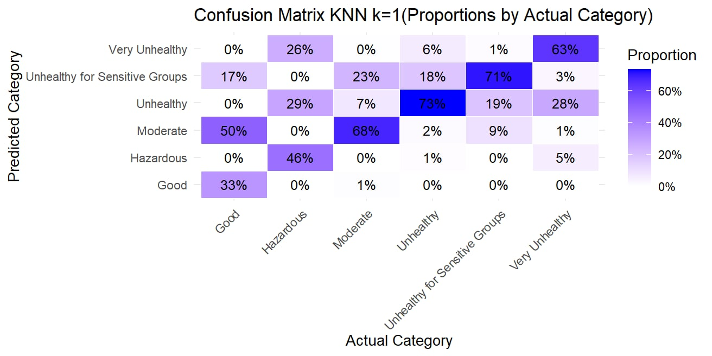
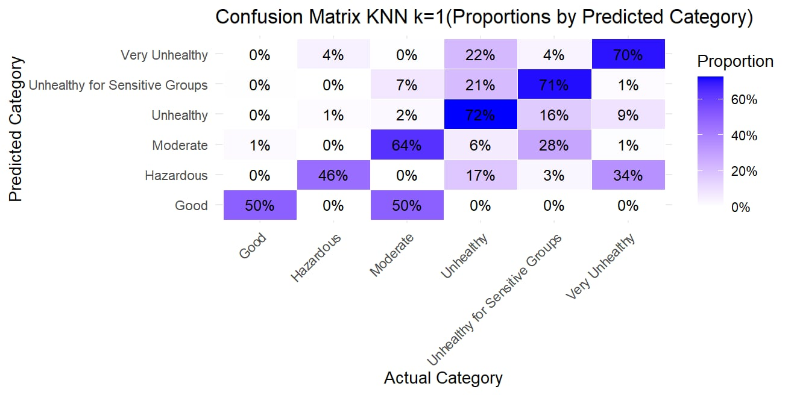
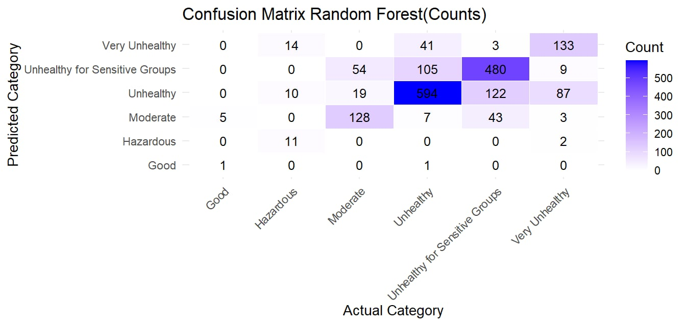
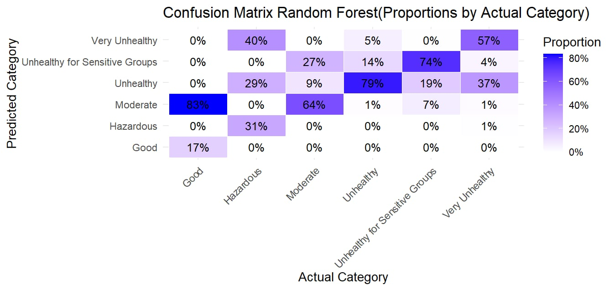
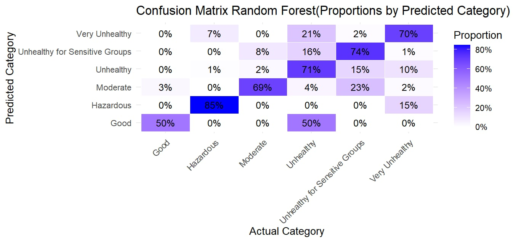

---
output:
  pdf_document: default
  html_document: default
---
```{r setup, include=FALSE}
knitr::opts_chunk$set(echo = FALSE)
# setwd("C:/Users/DucDo/OneDrive-UniversityofManitoba/Documents/University_documents/UofM/WInter2025/DATA2010/Air-Quality-Analysis-Project")

```

# Pattern Recognition and Machine Learning for Predicting Pollutant Concentrations and AQI Categories from Sensor and Environmental Data

## 1. Regression Analysis for Pollutant Concentrations Using KNN and Random Forest  

We extract the **month** column as an integer feature. Before training, all covariates (excluding target variables) undergo **Min-Max normalization** to eliminate unit bias:  

$$
X_{normalized} = \frac{X - \min(X)}{\max(X) - \min(X)}
$$

The dataset is split into **80% for training** and **20% for testing**.  

To ensure fair comparison across targets, we define the **normalized RMSE**, which expresses RMSE as a percentage of the test set mean:  

$$
\text{RMSE}_{\text{normalized}}^{\text{target}} = \frac{\text{RMSE}^{\text{target}}}{\text{mean(test}^{\text{target}})}
$$

### **a. KNN Regression Results**  

Through experiments, `k=5` yielded the best performance.

#### **Using Only Sensor Data**  

| Target | RMSE  | Normalized RMSE (%) |  
|--------|--------|----------------------|  
| CO     | 0.5779  | 28.07%  |  
| C6H6   | 3.6012  | 37.14%  |  
| NOx    | 75.7171 | 32.31%  |  
| NO2    | 21.0551 | **19.53%**  |  

#### **Using Sensor Data, Environmental Data, and Time (Month)**  

| Target | RMSE  | Normalized RMSE (%) |  
|--------|--------|----------------------|  
| CO     | 0.4979  | 24.19%  |  
| C6H6   | 1.8391  | 18.97%  |  
| NOx    | 59.5803 | 25.42%  |  
| NO2    | 17.6079 | **16.33%**  |  

Including **environmental and temporal features** significantly improves prediction accuracy across all pollutants. Among them, regression performed best on **NO2**.

### b. Random Forest regression

We use default parameter for `randomForest()` function.

#### **Using Only Sensor Data**  

| Target | RMSE  | Normalized RMSE (%) |  
|--------|--------|----------------------|  
| CO     | 0.4806  | 23.35%  |  
| C6H6   | 2.9008  | 29.92%  |  
| NOx    | 67.9865 | 29.01%  |  
| NO2    | 20.0721 | **18.62%**  |  

#### **Using Sensor Data, Environmental Data, and Time (Month)**  

| Target | RMSE  | Normalized RMSE (%) |  
|--------|--------|----------------------|  
| CO     | 0.4385  | 21.30%  |  
| C6H6   | 1.5624  | 16.11%  |  
| NOx    | 55.1452 | 23.53%  |  
| NO2    | 16.7216 | **15.51%**  |  

Likewise, adding environmental and temporal features greatly enhances prediction accuracy and the model performs best for **NO2**. Compared to KNN, Random Forest reduces normalized RMSE by an average of **4.0%** for sensor covariates and **2.1%** for all covariates, though it requires more training time.

### c. Make use of 3 SAPRC Proxy variables to predict NO2(GT)

Since Random Forest generally outperforms KNN, we will use it for this part.

To improve prediction accuracy for **NO2**, we incorporate domain knowledge by adding three new variables from *Part V* (**PAN_proxy, HONO_proxy, SAPRC_proxy**) to the covariates.

| Target | RMSE  | Normalized RMSE (%) |  
|--------|--------|----------------------|  
| NO2    | 13.9966 | **12.98%**  |  

Compared to the best previous performance on **NO2** (**15.51%**), incorporating domain knowledge reduces the normalized RMSE by **2.5%**, a notable improvement.


## 2. Pattern recognition visualization using PCA and K-Means clustering

Can we define a meaningful classification problem from this dataset? To explore this, we use visualization techniques to detect patterns, applying PCA for dimensionality reduction.  

### a. By Month  

Month is the only categorical variable in the dataset, so we perform PCA using all sensor and environmental variables.

{width=80%}  

A clear pattern emerges: months are clustered vertically, with colder months generally appearing in the upper half of the plot and hotter months in the lower half.  

However, classifying months based on air quality data is not particularly meaningful. A more relevant classification task is **AQI group classification**. As observed in *Part III*, AQI is linked to seasonal variations, suggesting that a month-based pattern likely corresponds to patterns in pollutant levels.

### b. By AQI Category

The target variable for classification is `AQI_Category` from *Part III*, computed using four pollutant concentrations. We perform PCA using all sensor, environmental variables, and the month variable, with points colored by `AQI_Category`.  

{width=80%}

As expected, a clear pattern emerges, indicating that this target is classifiable: pollutant levels increase horizontally from right to left.

### c. Can K-Means Clustering detect any pattern?

Although the average silhouette method suggests that `k=2` yields the most meaningful clusters, we set `k=6` to examine whether K-Means can capture a similar pattern to `AQI_Category`.  

{width=80%}

The result confirms this hypothesis: K-Means forms six clusters that roughly align with the horizontal trends observed in `AQI_Category` (*part b*). This finding is useful, as it suggests that pollutant levels can be categorized with reasonable accuracy using K-Means clustering alone, without the need for explicit AQI calculations.

## 3. AQI Category classification

It has been showed that `AQI Category` (pollutant levels) can be classified using month, sensor and environmental data. We will use `KNN` and `Random Forest`.

### a. KNN

Through experiments, `k=1` yielded the best performance with **accuracy = 69.87%**. The details result are as follows:

<!--  -->

```{r, fig.show='hold', out.width=c("33%", "33%", "33%")}
  # Top image
  # Bottom left
  # Bottom right
```

The performance is best for `Unhealthy` and `Unhealthy for Sensitive Groups`, which makes sense since the dataset is imbalanced, and these two groups represent the majority of the data. `Good` performs the worst as there are very few data points belonging to this group.

Some insights: **73%** of Unhealthy group are correctly predicted as Unhealthy.

### b. Random Forest

The performance is slightly better than KNN with **accuracy = 71.96%**.

```{r, fig.show='hold', out.width=c("33%", "33%", "33%")}
  # Top image
  # Bottom left
  # Bottom right
```

What we observed for KNN holds true for Random Forest as well.

Some insights: **79%** of the `Unhealthy` group are correctly predicted as `Unhealthy`. **85%** of data predicted as `Hazardous` actually belong to that group.

### c. Regression to Classify

Another approach is to use regression to compute pollutant concentrations, then use those to calculate AQI and derive the AQI Category.

We use the best regression result from part *1.b* and achieve **accuracy = 57.59%**, which is much worse than just classification.

## 4. Conclusion

In summary, Random Forest outperforms KNN in predicting pollutant concentrations and AQI categories. Incorporating environmental and temporal features, as well as domain knowledge such as SAPRC proxy variables, significantly improves model accuracy. 

While K-Means clustering provides a practical alternative for AQI categorization without explicit AQI calculations, regression to classify pollutants proves less effective than direct classification methods. These findings underscore the importance of selecting appropriate models and features for air quality prediction tasks.


