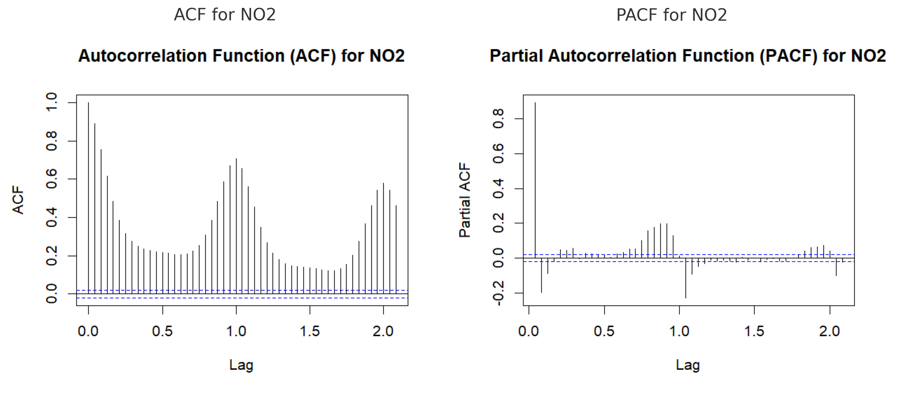

---
output:
  pdf_document: default
  html_document: default
---

```{r setup, include=FALSE}
knitr::opts_chunk$set(echo = TRUE)
```

# Hybrid Time Series Forecasting of $NO_2$ Using SARIMAX and SAPRC Simulation Proxies

## 1. Data Preprocessing Time Series Data and Stationarity Test

Preprocessing the time series involved cleaning the dataset, transforming variables as needed, and combining date and time fields into a proper datetime index. Ensuring that the statistical properties of the time series, such as mean, variance and autocorrelation, remained consistent over time.


The Augmented Dickey-Fuller (ADF) test was applied to assess stationarity in the $NO_2$ series. Results p-value approximately 0.01, with a significance level of 0.05, the p-value is below the threshold, leading to the rejection of the null hypothesis. Consequently, there is evidence to suggest that $NO_2$ series in the data is stationary, hence, no transformation needed for $NO_2$. Although the ACF shows strong seasonality, the ADF test confirms stationarity (p = 0.01). The PACF suggests an AR(1) structure with possible seasonal components. A seasonal autoregressive (AR) model could still be appropriate.

{width="617"}

## 2. Exploratory Data Analysis (EDA)

Key variables such as $NO_x$, $CO$, $C_6H_6$, and $O_3$ were examined in scatter plots to evaluate their relationship with $NO_2$. These plots revealed strong positive correlations, particularly between $NO_2$ and $NO_x$.

{width="615"}

#### STL Decomposition of the $NO_2$ Time Series

Using Seasonal-Trend Decomposition based on Loess (STL), the time series was broken down into trend, seasonal, and residual components. The trend captures gradual shifts in pollution levels over longer periods, while the seasonal pattern reflects consistent weekly cycles—possibly linked to differences in weekday versus weekend activity. The residual component isolates short-term fluctuations that are not explained by the trend or seasonality.

Higher concentrations of $NO_2$ were observed in the winter months (January–February 2005), with dips during summer, likely due to heating emissions and atmospheric conditions.

{width="648"}

{width="649"}

## 3. Time Series Analysis and Forecasting: SARIMAX

SARIMAX—Seasonal Autoregressive Integrated Moving Average with Exogenous Variables—is an advanced stochastic forecasting technique that extends the traditional ARIMA model. SARIMAX combines seasonal patterns (S), autoregressive (AR), Integrated Component (I), and moving average (MA) components to model time series data. It also incorporates exogenous variables (X) to account for external influences.

### a. SARIMAX Baseline Modeling

The baseline SARIMAX model was developed using $CO$, $NO_x$, $O_3$ as exogenous variables. We fit the model with auto.arima() function. This version achieved a Root Mean Square Error (RMSE) of **28.87**, indicating decent performance in capturing the general trend. However, the model underestimated peak values and exhibited lag during abrupt changes, showing limitations in short-term prediction.


### b. Hybrid Modeling with SAPRC Proxy Variables

#### 1. Motivation for Using SAPRC Proxies

By simulating SAPRC chemical reactions, we can include intermediate species like PAN and HONO and general SAPRC proxy, which play crucial roles in $NO_2$ behavior but aren't directly measured.

Peroxyacetyl Nitrate (PAN) decomposition releases $NO_2$ under warm conditions: $$
\mathrm{PAN} \xrightarrow{k_4} \mathrm{CH_3C(O)OO\cdot} + \mathrm{NO_2} 
$$

Nitrous Acid (HONO) photolysis contributes to NO production:

$$
  \mathrm{HONO} + h\nu \rightarrow \mathrm{NO} + \cdot\mathrm{OH}
$$

$$
  \mathrm{NO} + \mathrm{O_3} \rightarrow \mathrm{NO_2} + \mathrm{O_2}
$$

#### 2. SAPRC Proxy Equations

Peroxyacetyl Nitrate (PAN) Approximation (Polynomial Regression):

$$
PAN_{proxy} = a \times NOx + b\times NOx^2 + c \times C6H6 + d\times C6H6^2 + e \times O_3 + f \times T
$$

Nitrous Acid (HONO) Approximation (Non-Linear Regression):

$$
HONO_{proxy} = f \times NOx + g \times RH + h \times (NOx\times Rh) + i \times T + j  \times(NO_x\times T)
$$

SAPRC Proxy Approximation (Linear Regression): $$
SAPRC_{proxy} = k \times NOx+ p \times O_3 + q \times T + r \times RH
$$

#### 3. Hybrid SARIMAX with SAPRC:

A comprehensive SARIMAX model was developed by incorporating the SAPRC-based proxy variables (PAN, HONO, and overall SAPRC chemical activity) as additional predictors. This hybrid approach significantly improved the model's forecasting accuracy, reducing RMSE to **21.73** compared to the earlier baseline.


### c. 12-Week Forecast of Weekly $NO_2$ Using SARIMAX with SAPRC

The 12-week SARIMAX forecast shows a gradual decline in $NO_2$ levels from April to July 2005, consistent with seasonal patterns seen in previous years. The model captures the typical drop in concentrations during warmer months, with uncertainty increasing over time. This suggests improved air quality is expected as the region transitions into summer. The widening 80% confidence interval reflects increasing uncertainty and variability in $NO_2$ predictions over time.


## 4. Conclusion

The forecasting analysis confirmed strong seasonality in $NO_2$ levels, with higher concentrations in winter and consistent weekly patterns. Strong correlations were identified between $NO_2$ and key pollutants, particularly $NO_x$. While the basic SARIMAX model captured overall trends, it struggled with rapid changes, achieving an **RMSE = 28.87**.

By adding SAPRC-based chemical proxies such as PAN and HONO, the hybrid model significantly improved accuracy with **RMSE = 21.73**, better matched actual $NO_2$ values. The proxy variables better captured the chemical interactions affecting $NO_2$ concentrations, making predictions more accurate, especially during peak emissions and seasonal shifts.
