```{r setup, include=FALSE}
knitr::opts_chunk$set(echo = TRUE)
```

\pagebreak

# I. Introduction:

The **UCI Air Quality dataset** provides a comprehensive record of pollution levels in Rome, Italy, capturing hourly measurements of key pollutants—including Carbon Monoxide ($CO$), Nitrogen Dioxide ($NO_2$), Total Nitrogen Oxides ($NO_x$), Benzene ($C_6H_6$), and Non-Methane Hydrocarbons ($NMHC$)—alongside sensor responses and environmental variables such as temperature and humidity. This dataset offers a unique opportunity to analyze sensor performance, assess air quality trends, and develop predictive models for pollutant concentrations.

This analysis is structured into four key components: **sensor calibration and air quality assessment**, which evaluates the correlation between sensor readings and true pollutant concentrations while detecting cross-sensitivities and analyzing seasonal AQI variations; **regression-based CO prediction**, which aims to develop models for estimating CO levels based on sensor and environmental data; **time series and hybrid modeling**, which explores temporal trends and advanced modeling techniques for pollutant forecasting; and **machine learning comparison**, which assesses different algorithms to determine the most effective approaches for air quality prediction and monitoring.

# II. Preprocessing

The air quality data was initially cleaned by removing empty rows and columns, and by converting character columns—where commas were used as decimal points—into proper numeric format. The Date column was also converted from string format to a proper date type.

| CO.GT. | NMHC.GT. | C6H6.GT. | NOx.GT. | NO2.GT. | T   | RH  | AH  |
|--------|----------|----------|---------|---------|-----|-----|-----|
| 1683   | 8443     | 366      | 1639    | 1642    | 366 | 366 | 366 |

| PT08.S1.CO. | PT08.S2.NMHC. | PT08.S3.NOx. | PT08.S4.NO2. | PT08.S5.O3. |
|-------------|---------------|--------------|--------------|-------------|
| 366         | 366           | 366          | 366          | 366         |

| Number of missing data | n    |
|------------------------|------|
| 0                      | 827  |
| 1                      | 6138 |
| 2                      | 467  |
| 3                      | 364  |
| 4                      | 1195 |
| 9                      | 26   |
| 10                     | 291  |
| 11                     | 6    |
| 12                     | 12   |
| 13                     | 31   |

To handle missing data, we first identified gaps using the is.na() and summary() functions. Since -200 was used as a placeholder for missing values, it was temporarily replaced with 0 to allow for five-number summary analysis and help determine which variables were most affected. During this process, we observed that the median value of NMHC_GT is 0, indicating that this variable may contain a large number of zero values, which could impact interpretation and imputation strategies.

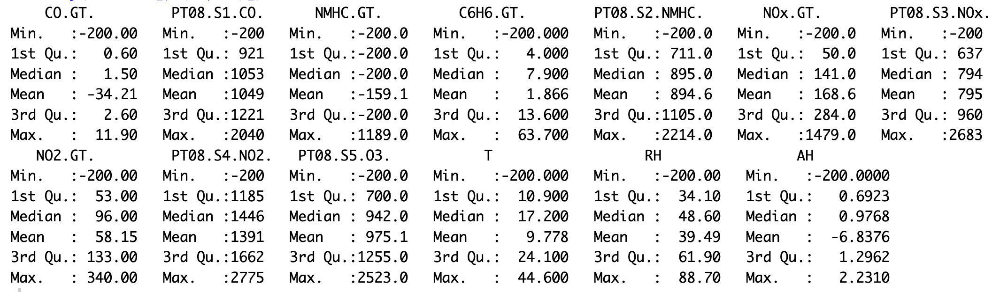{width="705"}

After examining the data's summary statistics and missingness patterns, we found that some variables exhibit Missing Not At Random (MNAR) behavior, while others are Missing At Random (MAR). Imputation was then applied based on variable type: for time-series columns such as T, RH, and AH, we used multiple imputation methods including forward fill, backward fill, and interpolation. For correlated sensor variables, we applied KNN imputation, as these features included both continuous and categorical data. The improvements from cleaning and imputing were evident upon reviewing the updated five-number summaries.

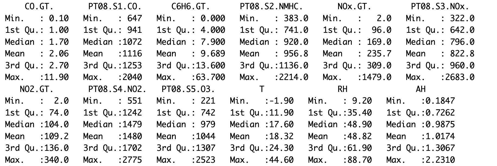{width="676"}

# III. Correlation Analysis and Air Quality Index

## 1. Data Characteristics and Correlation Analysis

### 1.1 Exploratory Data Analysis (EDA)

The Histograms reveal right-skewed distributions for all pollutants. This non-normality motivates the use of **non-parametric correlation measures**. Additionally, boximages highlight the presence of significant outliers across all pollutants. The consistent pattern of **median concentrations being lower than the means** confirms the positive skewness of the data.

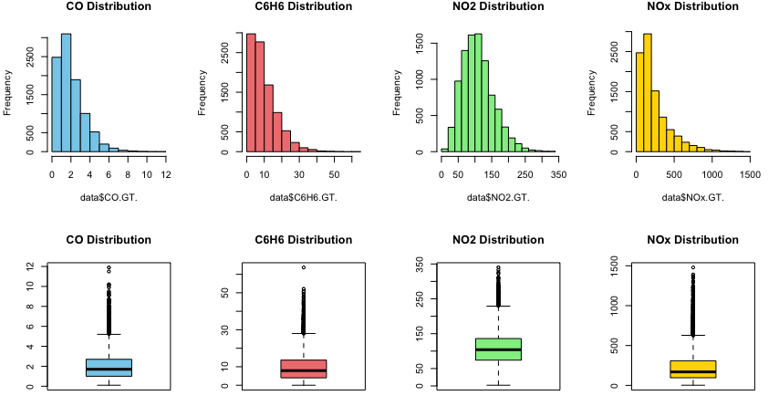{width="678"}

### 1.2 Correlation Matrix Interpretation

### Methodology

Given the non-normal distributions and the presence of extreme values, we utilize Spearman's rank correlation ($\rho$), a non-parametric measure that captures monotonic relationships without assuming linearity.

### Sensor-Pollutant Relationships:

{width="550"}

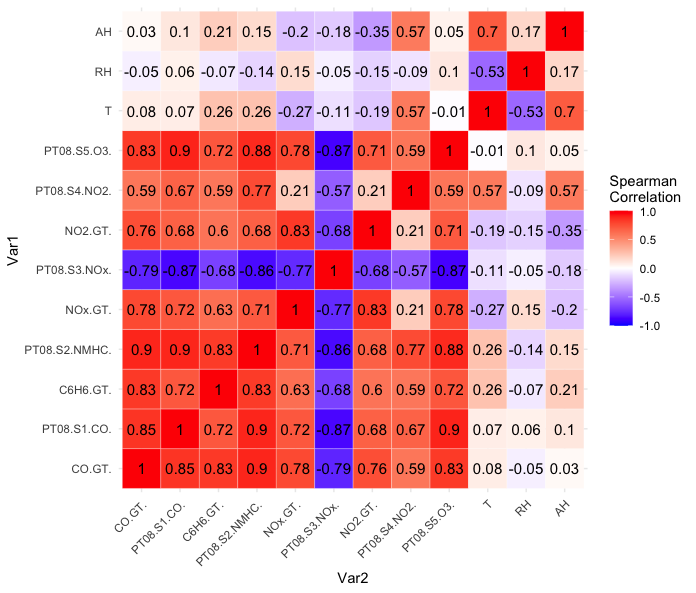{width="479"}

The Correlation Heatmap reveals: The relationships between pollutants and sensors show a strong positive correlation for `CO` and `Sensor CO` ($\rho$ = 0.85) and a strong negative correlation for $NO_x$ and `Sensor NOx` ($\rho$ = -0.77), while `NO2` and `Sensor NO2` have a weak correlation ($\rho$ = 0.21). Pollutants exhibit weak or no correlation with environmental factors ($\rho$ $\in$ (-0.35, 0.28)). However, cross-sensitivity detection suggests potential sensor interference, as `CO` correlates highly with `Sensor NOx, NMHC, and O3`, $NO_x$ and `NO2` show moderate correlation with `Sensor CO, NMHC, and O3`, and $C_6H_6$ has high correlation with `Sensor NMHC` and moderate correlation with other sensors.

### 1.3 Robust Correlation Validation by Permutation Test

### Methodology

To verify sensor-reference pollutant correlations beyond traditional correlation metrics, we conducted permutation tests (n = 1000 iterations). This non-parametric approach: First we compute the observed Spearman's $\rho$, then generating a null distribution by shuffling reference values, using those to calculate empirical p-values

### Result

The permutation test for $CO$, $NO_2$ and $NO_x$ against their respective sensors yielded empirical **p-value \< 0.001**, we have sufficient evidence to conclude that there are strong and statistically significant correlation between sensor and corresponding concentration. As a **non-parametric test**, this validation method strengthens the confidence in our findings **without relying on normality assumptions**.

## 2. Air Quality Index (AQI) Analysis

### 2.1 Understanding AQI

### What is AQI?

The Air Quality Index (AQI) is a standardized metric used to communicate the health risks of air pollution. It translates complex pollutant concentration data into a single, easy-to-understand value on a 0 - 500 scale, with higer values indicating worse air quality.

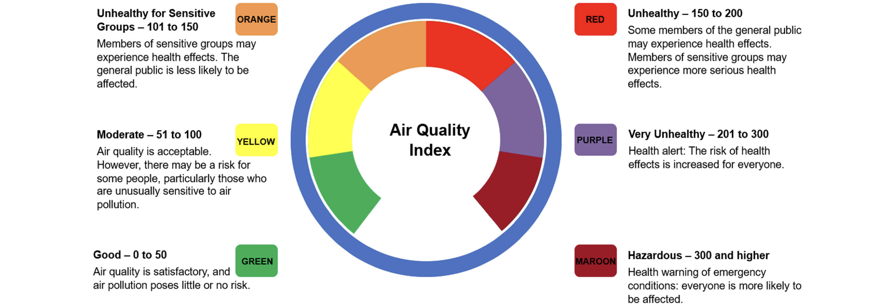

### Custom AQI Methodology

In this study, we employ a **Custom AQI** methodology where $CO$ and $NO_2$ follow standard **EPA AQI** breakpoints, benzene ($C_6H_6$) is assessed using **WHO exposure limits**, and $NO_x$ is evaluated using the same breakpoints ranges as $NO_2$. This approach ensures alignment with established regulatory standards while incorporating WHO-recommended guidelines for benzene exposure.

### 2.2 AQI Calculation Methodology

The AQI is computed as:

$$
AQI = \max\left(\frac{I_{HI}-I_{LO}}{BP_{HI}-BP_{LO}}(C-BP_{LO}) + I_{LO}\right) \text{ across all pollutants}
$$

where:

-   $I_{HI/LO}$ = AQI category thresholds
-   $BP_{HI/LO}$ = Breakpoints concentrations
-   $C$ = Observed pollutant concentration

**Breakpoints reference table:**

| Category | $AQI Range$ | $CO$ | $NO_2$ | $NO_x$ | $C_6H_6$ |
|------------|------------|------------|------------|------------|------------|
| **Good** | 0-50 | 0-4.4 | 0-53 | 0-53 | 0-3 |
| **Moderate** | 51-100 | 4.4-9.4 | 53-100 | 53-100 | 3-7 |
| **Unhealthy for Sensitive Groups** | 101-150 | 9.4-12.4 | 100-360 | 100-360 | 7-10 |
| **Unhealthy** | 151-200 | 12.4-15.4 | 360-649 | 360-649 | 10-15 |
| **Very Unhealthy** | 201-300 | 15.4-30.4 | 649-1249 | 649-1249 | 15-20 |
| **Hazardous** | 301-500 | 30.4-50.4 | 1249-2049 | 1249-2049 | 20-30 |

### 2.3 Temporal AQI Patterns

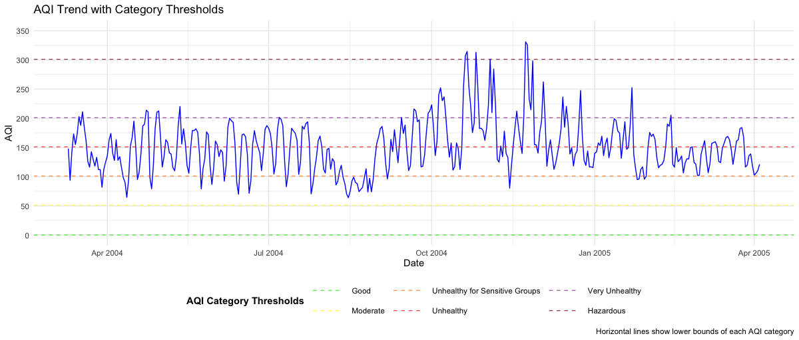

The AQI trend shows significant fluctuations, frequently exceeding the `Unhealthy for Sensitive Groups` and `Unhealthy` thresholds, with occasional peaks reaching `Very Unhealthy` levels. The highest peaks, reaching `Hazardous` range, are observed during late 2004. A sharp rise in AQI during Winter suggests increased pollution, likely due to heightened combustion activities, while Summer peaks align with high benzene ($C_6H_6$) contributions. Early 2005 shows a slight decline in AQI, though persistent fluctuations suggest evolving emission patterns and seasonal influences on air quality.

### 2.4 Pollutant-Specific Contributions

| Season       | Primary Pollutant | Contribution |
|--------------|-------------------|-------------:|
| Spring(2004) | $C_6H_6$          |     `87.95`% |
| Summer       | $C_6H_6$          |     `90.22`% |
| Fall         | $C_6H_6$          |     `76.92`% |
| Winter       | $NO_x$            |     `67.78`% |
| Spring(2005) | $NO_x$            |     `54.29`% |

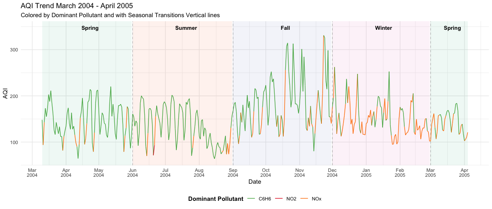

Table 2 summarizes the seasonal contributions of individual pollutans to AQI, revealing that benzene ($C_6H_6$) is the dominant pollutant in Spring, Summer and Fall, accounting for over 75% of AQI excrescences, with a peak contributes of 90.22% during Summer. In contrast, Winter AQI is primarily influenced by $NO_x$ , which contributes 67.78%, likely due to increased combustion activities. The transition period in early Spring 2005 marks a shift, where $NO_x$ and $C_6H_6$ exhibit nearly equal contributions, indicating a changing pollution patterns over time.

## 4. Seasonal Variation Analysis

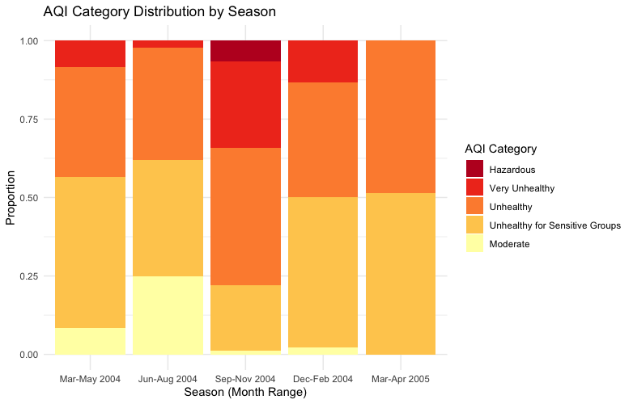{width="402"}

The AQI category distribution varies by season, showing a shift from moderate air quality in Spring (Mar–May 2004) to worsening conditions in Summer (Jun–Aug 2004) and Fall (Sep–Nov 2004), where "Unhealthy" and "Very Unhealthy" categories dominate, with a small proportion reaching "Hazardous" levels. Winter (Dec–Feb 2004) continues to have high pollution, with a majority in the "Unhealthy for Sensitive Groups" and "Unhealthy" categories, while early Spring (Mar–Apr 2005) shows slight improvement with a higher proportion of moderate air quality. This seasonal pattern suggests increased pollution in Fall and Winter, likely due to combustion-related emissions, while air quality improves slightly in transitional periods.

# IV. Linear Regression-Based Prediction of CO(GT)

## 1. Regression Modelling for CO Prediction

#### Baseline Model

In the Baseline Model, the RMSE was **1.416849**. This model simply predicts the mean CO(GT) for all instances without using any predictors. It serves as a basic reference point for evaluating other models.

#### Single Variable Model (CO Sensor)

When using a Single Variable Model with only the CO Sensor, the RMSE dropped to **0.7662274**. This shows a noticeable improvement compared to the baseline, indicating that the CO Sensor captures important information about CO(GT).

#### Full Model (All Predictors)

The Full Model, which uses all available environmental and sensor variables, achieved an even lower RMSE of **0.4108955**. This substantial reduction highlights that including multiple predictors further enhances model performance.

| Model                       | RMSE      |
|-----------------------------|-----------|
| Baseline Model              | 1.416849  |
| Single Variable (CO Sensor) | 0.7662274 |
| Full Model (All Predictors) | 0.4108955 |

Overall, the results demonstrate that while the CO Sensor alone offers significant predictive power, combining it with other environmental variables leads to even more accurate predictions of CO(GT).

## 2. Impact of Including SensorCO in Linear Regression Models

To assess the importance of sensor data, particularly the CO sensor (`PT08.S1.CO.`), we compared the Linear Regression models: one using only environmental variables (Temperature, Humidity, and Hour), and another that included the CO sensor reading as an additional predictor.

#### Without CO Sensor

The Linear Regression model using only Temperature, Humidity, and Hour resulted in an RMSE of **1.304**. These value indicate limited predictive power, suggesting that environmental factors alone are not sufficient to accurately estimate CO(GT) levels in a linear framework.

#### With CO Sensor

After including SensorCO, the model’s performance improved significantly, achieving an RMSE of **0.748**. This highlights the importance of sensor data, as it captures key variations in CO(GT) that environmental variables miss.sor input captures meaningful variance in the CO(GT) values, significantly boosting model accuracy.

| Model             | RMSE  |
|-------------------|-------|
| Without CO Sensor | 1.304 |
| With CO Sensor    | 0.748 |

This shows that the sensor input captures meaningful variance in the CO(GT) values, significantly boosting model accuracy.

## 3. Introducing Random Forest Models: With and Without SensorCO

Random Forest is a powerful ensemble learning method that builds multiple decision trees and averages their outputs, allowing it to capture complex nonlinear relationships that linear models often miss. Unlike linear regression, which assumes a straight-line relationship between predictors and the target, Random Forest can adapt to patterns and interactions among variables, making it especially effective for modeling air quality data.

#### Without SensorCO

When applied to our dataset, the Random Forest model using only Temperature, Humidity, and Hour achieved an RMSE of **1.087** showing modest improvements over linear regression.

#### With SensorCO

However, after adding the SensorCO variable, the model's performance improved significantly, achieving an RMSE of **0.595**.

| Model                           | RMSE  |
|---------------------------------|-------|
| Random forest Without CO Sensor | 1.087 |
| Random forest with CO Sensor    | 0.595 |

This confirms that Random Forest not only handles nonlinearities better but also maximizes the predictive power of key sensor inputs like SensorCO.

## 4. Evaluation and Model Comparison

To determine the best approach for predicting CO(GT), we compared several models based on their use of environmental variables, sensor inputs, and modeling techniques (Linear Regression vs. Random Forest).

| Model                                | RMSE      |
|--------------------------------------|-----------|
| Baseline Model                       | 1.416849  |
| Single Variable (CO Sensor)          | 0.7662274 |
| Full Linear Model (All Predictors)   | 0.4108955 |
| Linear Regression (Without SensorCO) | 1.304     |
| Linear Regression (With SensorCO)    | 0.748     |
| Random Forest (Without SensorCO)     | 1.087     |
| Random Forest (With SensorCO)        | 0.595     |

From the results, the Random Forest model with SensorCO clearly outperforms all other models across all evaluation metrics. It captures the non-linear relationships between the predictors and the target variable better than linear models, and the inclusion of SensorCO dramatically improves prediction accuracy.

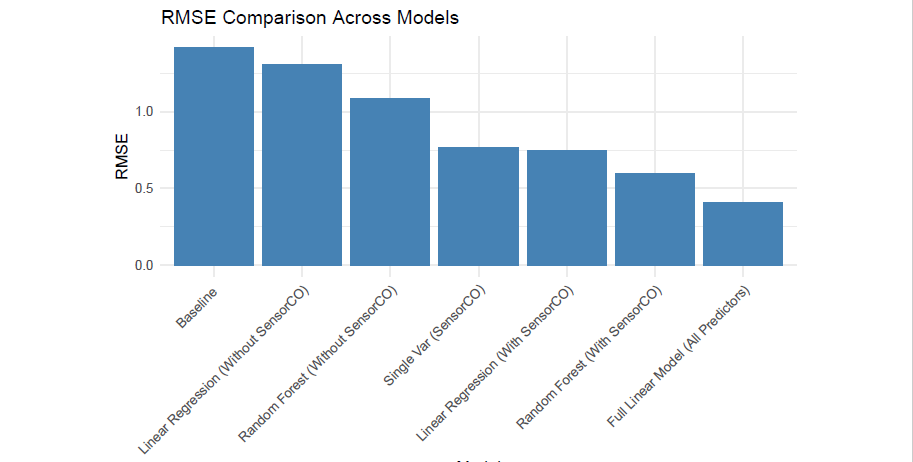{width="498"}

## 5. Diagnostic Analysis

Residual analysis was conducted to evaluate whether the models exhibited any systematic biases or time-based error patterns.

For the selected-variable model, residuals were plotted against the hour of the day, revealing no significant time-dependent trends or heteroscedasticity.

Predicted versus actual plots for the Random Forest model showed a tight clustering around the 45-degree line, especially for low and mid-range CO values. This confirmed that the model was accurately predicting most values and only slightly underestimating extreme values, likely due to fewer observations in the higher range.

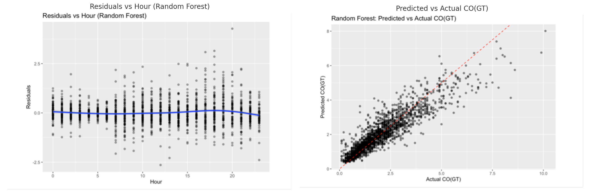

## 6. Conclusion

The full model achieves lower RMSE due to the inclusion of more predictors like NOx.GT. and C6H6.GT., which are highly correlated with CO. However, this comes with risks such as overfitting and reduced interpretability. In contrast, using just Temperature, Humidity, Hour, and SensorCO provides strong performance (R² = 0.83, RMSE = 0.60) with fewer variables. These inputs are easy to measure, making the model simpler, faster, and more practical. Overall, the selected-variable model strikes an ideal balance between accuracy and usability.

# V. Hybrid Time Series Forecasting of $NO_2$ Using SARIMAX and SAPRC Simulation Proxies

## 1. Data Preprocessing Time Series Data and Stationarity Test

The Augmented Dickey-Fuller (ADF) test was applied to assess stationarity in the $NO_2$ series. Results p-value approximately 0.01, with a significance level of 0.05, the p-value is below the threshold, leading to the rejection of the null hypothesis. Consequently, there is evidence to suggest that $NO_2$ series in the data is stationary, hence, no transformation needed for $NO_2$. Although the ACF shows strong seasonality, the ADF test confirms stationarity (p = 0.01). The PACF suggests an AR(1) structure with possible seasonal components. A seasonal autoregressive (AR) model could still be appropriate.


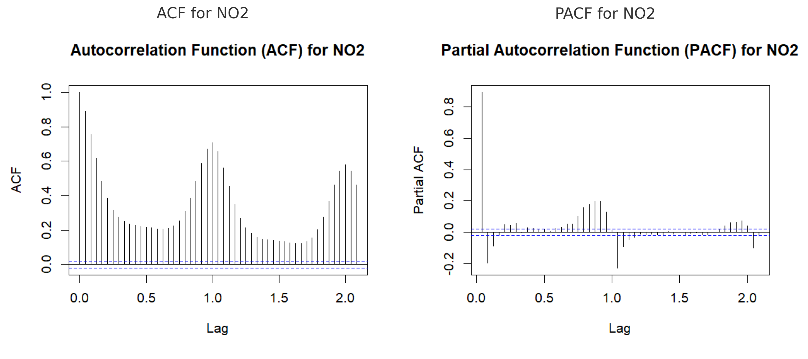{width="617"}

## 2. Exploratory Data Analysis (EDA)

Key variables such as $NO_x$, $CO$, $C_6H_6$, and $O_3$ were examined in scatter plots to evaluate their relationship with $NO_2$. These plots revealed strong positive correlations, particularly between $NO_2$ and $NO_x$.

{width="615"}

#### STL Decomposition of the $NO_2$ Time Series

Using Seasonal-Trend Decomposition based on Loess (STL), the time series was broken down into trend, seasonal, and residual components. The trend captures gradual shifts in pollution levels over longer periods, while the seasonal pattern reflects consistent weekly cycles—possibly linked to differences in weekday versus weekend activity. The residual component isolates short-term fluctuations that are not explained by the trend or seasonality.

Higher concentrations of $NO_2$ were observed in the winter months (January–February 2005), with dips during summer, likely due to heating emissions and atmospheric conditions.

{width="648"}

{width="649"}

## 3. Time Series Analysis and Forecasting: SARIMAX

SARIMAX—Seasonal Autoregressive Integrated Moving Average with Exogenous Variables—is an advanced stochastic forecasting technique that extends the traditional ARIMA model. SARIMAX combines seasonal patterns (S), autoregressive (AR), Integrated Component (I), and moving average (MA) components to model time series data. It also incorporates exogenous variables (X) to account for external influences.

### 3.1 SARIMAX Baseline Modeling

The baseline SARIMAX model was developed using $CO$, $NO_x$, $O_3$ as exogenous variables. This achieved a Root Mean Square Error (RMSE) of **28.87**, indicating decent performance in capturing the general trend. However, the model underestimated peak values and exhibited lag during abrupt changes, showing limitations in short-term prediction.


### 3.2 Hybrid Modeling with SAPRC Proxy Variables

#### 3.2.1 Motivation for Using SAPRC Proxies

By simulating SAPRC chemical reactions, we can include intermediate species like PAN and HONO and general SAPRC proxy, which play crucial roles in $NO_2$ behavior but aren't directly measured.

Peroxyacetyl Nitrate (PAN) decomposition releases $NO_2$ under warm conditions: 
$$
\mathrm{PAN} \xrightarrow{k_4} \mathrm{CH_3C(O)OO\cdot} + \mathrm{NO_2} 
$$

Nitrous Acid (HONO) photolysis contributes to NO production:

$$
  \mathrm{HONO} + h\nu \rightarrow \mathrm{NO} + \cdot\mathrm{OH} \text{  =>  } \mathrm{NO} + \mathrm{O_3} \rightarrow \mathrm{NO_2} + \mathrm{O_2}
$$

#### 3.2.2 SAPRC Proxy Equations

Peroxyacetyl Nitrate (PAN) Approximation (Polynomial Regression):

$$
PAN_{proxy} = a \times NOx + b\times NOx^2 + c \times C6H6 + d\times C6H6^2 + e \times O_3 + f \times T
$$

Nitrous Acid (HONO) Approximation (Non-Linear Regression):

$$
HONO_{proxy} = f \times NOx + g \times RH + h \times (NOx\times Rh) + i \times T + j  \times(NO_x\times T)
$$

SAPRC Proxy Approximation (Linear Regression): 
$$
SAPRC_{proxy} = k \times NOx+ p \times O_3 + q \times T + r \times RH
$$

#### 3.2.3 Hybrid SARIMAX with SAPRC:

A comprehensive SARIMAX model was developed by incorporating the SAPRC-based proxy variables (PAN, HONO, and overall SAPRC chemical activity) as additional predictors. This hybrid approach significantly improved the model's forecasting accuracy, reducing RMSE to **21.73** compared to the earlier baseline.


### 3.3 12-Week Forecast of Weekly $NO_2$ Using SARIMAX with SAPRC

The 12-week SARIMAX forecast shows a gradual decline in $NO_2$ levels from April to July 2005, consistent with seasonal patterns seen in previous years. The model captures the typical drop in concentrations during warmer months, with uncertainty increasing over time. This suggests improved air quality is expected as the region transitions into summer. The widening 80% confidence interval reflects increasing uncertainty and variability in $NO_2$ predictions over time.

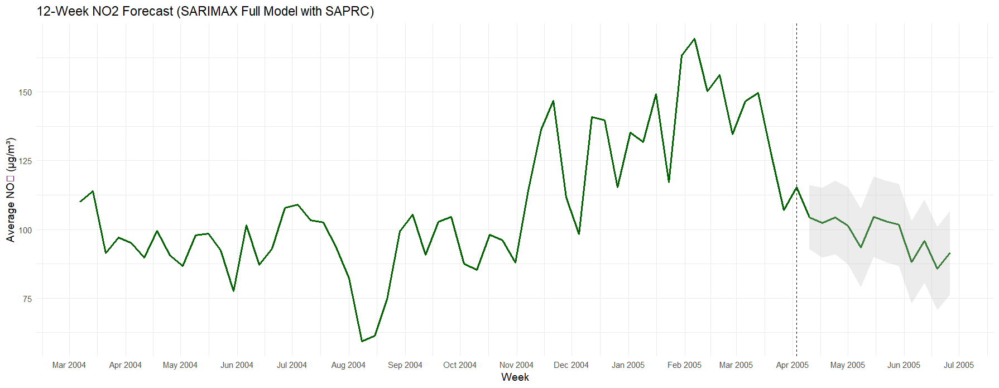

## 4 Conclusion

The forecasting analysis confirmed strong seasonality in $NO_2$ levels, with higher concentrations in winter and consistent weekly patterns. Strong correlations were identified between $NO_2$ and key pollutants, particularly $NO_x$. While the basic SARIMAX model captured overall trends, it struggled with rapid changes, achieving an **RMSE = 28.87**.

By adding SAPRC-based chemical proxies such as PAN and HONO, the hybrid model significantly improved accuracy with **RMSE = 21.73**, better matched actual $NO_2$ values. The proxy variables better captured the chemical interactions affecting $NO_2$ concentrations, making predictions more accurate, especially during peak emissions and seasonal shifts.

