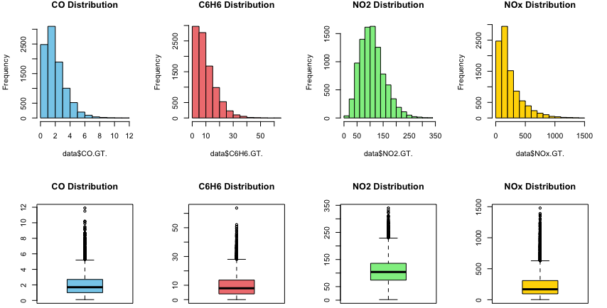
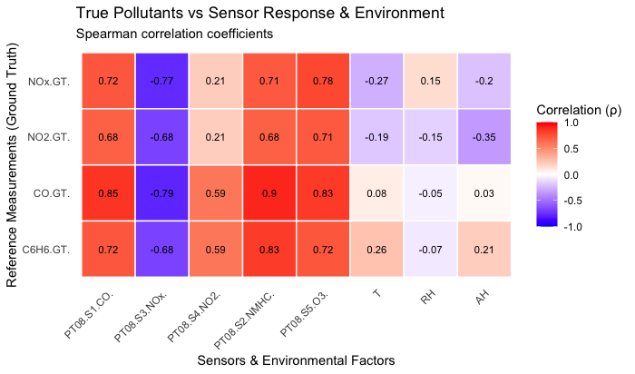
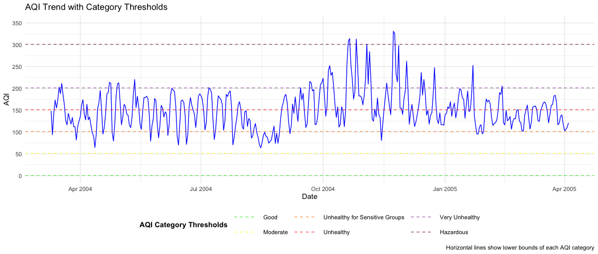
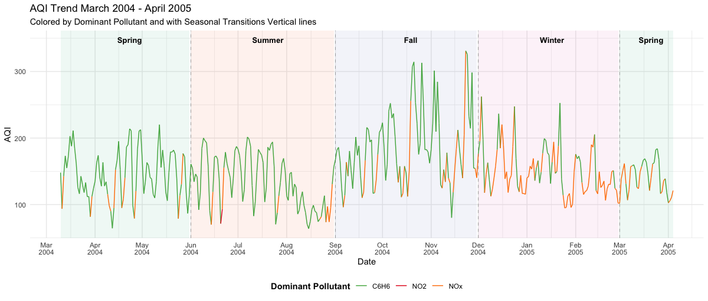
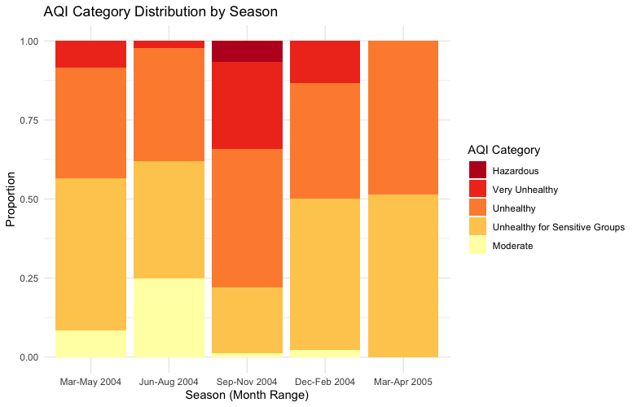

```{r setup, include=FALSE}
knitr::opts_chunk$set(echo = TRUE)
```

# Introduction:

The **UCI Air Quality dataset** provides a comprehensive record of pollution levels in Rome, Italy, capturing hourly measurements of key pollutants—including Carbon Monoxide ($CO$), Nitrogen Dioxide ($NO_2$), Total Nitrogen Oxides ($NO_x$), Benzene ($C_6H_6$), and Non-Methane Hydrocarbons ($NMHC$)—alongside sensor responses and environmental variables such as temperature and humidity. This dataset offers a unique opportunity to analyze sensor performance, assess air quality trends, and develop predictive models for pollutant concentrations. This analysis is structured into four key components: **sensor calibration and air quality assessment**, which evaluates the correlation between sensor readings and true pollutant concentrations while detecting cross-sensitivities and analyzing seasonal AQI variations; **regression-based CO prediction**, which aims to develop models for estimating CO levels based on sensor and environmental data; **time series and hybrid modeling**, which explores temporal trends and advanced modeling techniques for pollutant forecasting; and **machine learning comparison**, which assesses different algorithms to determine the most effective approaches for air quality prediction and monitoring.

# Preprocessing

## Formating

The air quality data was initially cleaned by removing empty rows and columns, and by converting character columns—where commas were used as decimal points—into proper numeric format. The Date column was also converted from string format to a proper date type.

| CO.GT. | NMHC.GT. | C6H6.GT. | NOx.GT. | NO2.GT. | T   | RH  | AH  |
|--------|----------|----------|---------|--------|-----|-----|-----|
| 1683   | 8443     | 366      | 1639    | 1642   | 366 | 366 | 366 |

| PT08.S1.CO. | PT08.S2.NMHC. | PT08.S3.NOx. | PT08.S4.NO2. | PT08.S5.O3. |
|-------------|----------------|---------------|----------------|--------------|
| 366         | 366            | 366           | 366            | 366          |


| Number of missing data | n    |
|------------------------|------|
| 0                      | 827  |
| 1                      | 6138 |
| 2                      | 467  |
| 3                      | 364  |
| 4                      | 1195 |
| 9                      | 26   |
| 10                     | 291  |
| 11                     | 6    |
| 12                     | 12   |
| 13                     | 31   |

To handle missing data, we first identified gaps using the is.na() and summary() functions. Since -200 was used as a placeholder for missing values, it was temporarily replaced with 0 to allow for five-number summary analysis and help determine which variables were most affected. During this process, we observed that the median value of NMHC_GT is 0, indicating that this variable may contain a large number of zero values, which could impact interpretation and imputation strategies.


After examining the data's summary statistics and missingness patterns, we found that some variables exhibit Missing Not At Random (MNAR) behavior, while others are Missing At Random (MAR). Imputation was then applied based on variable type: for time-series columns such as T, RH, and AH, we used multiple imputation methods including forward fill, backward fill, and interpolation. For correlated sensor variables, we applied KNN imputation, as these features included both continuous and categorical data. The improvements from cleaning and imputing were evident upon reviewing the updated five-number summaries.


# Correlation and AQI

## 1. Data Characteristics and Correlation Analysis

### 1.1 Exploratory Data Analysis (EDA)

### Distribution & Outlier Analysis



**Figure 1**: The Histograms reveal right-skewed distributions for all pollutants. This non-normality motivates the use of **non-parametric correlation measures**. Additionally, boxplots highlight the presence of significant outliers across all pollutants. The consistent pattern of **median concentrations being lower than the means** confirms the positive skewness of the data.

### 1.2 Correlation Matrix Interpretation

### Methodology

Given the non-normal distributions and the presence of extreme values, we utilize Spearman's rank correlation ($\rho$), a non-parametric measure that captures monotonic relationships without assuming linearity.

### Sensor-Pollutant Relationships:

{width="512"}



**Figure 2**: The Correlation Heatmap reveals: The relationships between pollutants and sensors show a strong positive correlation for `CO` and `Sensor CO` ($\rho$ = 0.85) and a strong negative correlation for $NO_x$ and `Sensor NOx` ($\rho$ = -0.77), while `NO2` and `Sensor NO2` have a weak correlation ($\rho$ = 0.21). Pollutants exhibit weak or no correlation with environmental factors ($\rho$ $\in$ (-0.35, 0.28)). However, cross-sensitivity detection suggests potential sensor interference, as `CO` correlates highly with `Sensor NOx, NMHC, and O3`, $NO_x$ and `NO2` show moderate correlation with `Sensor CO, NMHC, and O3`, and $C_6H_6$ has high correlation with `Sensor NMHC` and moderate correlation with other sensors.

### 1.3 Robust Correlation Validation

### Methodology

To verify sensor-reference pollutant correlations beyond traditional correlation metrics, we conducted permutation tests (n = 1000 iterations). This non-parametric approach: First we compute the observed Spearman's $\rho$, then generating a null distribution by shuffling reference values, using those to calculate empirical p-values

### Result

The permutation test for $CO$, $NO_2$ and $NO_x$ against their respective sensors yielded empirical **p-value \< 0.001**, we have sufficient evidence to conclude that there are strong and statistically significant correlation between sensor and corresponding concentration. As a **non-parametric test**, this validation method strengthens the confidence in our findings **without relying on normality assumptions**.

## 2. Air Quality Index (AQI) Analysis

### 2.1 Understanding AQI

### What is AQI?

The Air Quality Index (AQI) is a standardized metric used to communicate the health risks of air pollution. It translates complex pollutant concentration data into a single, easy-to-understand value on a 0 - 500 scale, with higer values indicating worse air quality.

### Custom AQI Methodology

In this study, we employ a **Custom AQI** methodology where $CO$ and $NO_2$ follow standard **EPA AQI** breakpoints, benzene ($C_6H_6$) is assessed using **WHO exposure limits**, and $NO_x$ is evaluated using the same breakpoints ranges as $NO_2$. This approach ensures alignment with established regulatory standards while incorporating WHO-recommended guidelines for benzene exposure.

### 2.2 AQI Calculation Methodology

The AQI is computed as:

$$
AQI = \max\left(\frac{I_{HI}-I_{LO}}{BP_{HI}-BP_{LO}}(C-BP_{LO}) + I_{LO}\right) \text{ across all pollutants}
$$

where:

-   $I_{HI/LO}$ = AQI category thresholds
-   $BP_{HI/LO}$ = Breakpoints concentrations
-   $C$ = Observed pollutant concentration

**Breakpoints reference table:**

| Category | $AQI Range$ | $CO$ | $NO_2$ | $NO_x$ | $C_6H_6$ |
|------------|------------|------------|------------|------------|------------|
| **Good** | 0-50 | 0-4.4 | 0-53 | 0-53 | 0-3 |
| **Moderate** | 51-100 | 4.4-9.4 | 53-100 | 53-100 | 3-7 |
| **Unhealthy for Sensitive Groups** | 101-150 | 9.4-12.4 | 100-360 | 100-360 | 7-10 |
| **Unhealthy** | 151-200 | 12.4-15.4 | 360-649 | 360-649 | 10-15 |
| **Very Unhealthy** | 201-300 | 15.4-30.4 | 649-1249 | 649-1249 | 15-20 |
| **Hazardous** | 301-500 | 30.4-50.4 | 1249-2049 | 1249-2049 | 20-30 |

### 2.3 Temporal AQI Patterns



**Figure 3**: The AQI trend shows significant fluctuations, frequently exceeding the `Unhealthy for Sensitive Groups` and `Unhealthy` thresholds, with occasional peaks reaching `Very Unhealthy` levels. The highest peaks, reaching `Hazardous` range, are observed during late 2004. A sharp rise in AQI during Winter suggests increased pollution, likely due to heightened combustion activities, while Summer peaks align with high benzene ($C_6H_6$) contributions. Early 2005 shows a slight decline in AQI, though persistent fluctuations suggest evolving emission patterns and seasonal influences on air quality.

### 2.4 Pollutant-Specific Contributions



| Season       | Primary Pollutant | Contribution |
|--------------|-------------------|-------------:|
| Spring(2004) | $C_6H_6$          |     `87.95`% |
| Summer       | $C_6H_6$          |     `90.22`% |
| Fall         | $C_6H_6$          |     `76.92`% |
| Winter       | $NO_x$            |     `67.78`% |
| Spring(2005) | $NO_x$            |     `54.29`% |

**Figure 4**: Table 2 summarizes the seasonal contributions of individual pollutans to AQI, revealing that benzene ($C_6H_6$) is the dominant pollutant in Spring, Summer and Fall, accounting for over 75% of AQI excrescences, with a peak contributes of 90.22% during Summer. In contrast, Winter AQI is primarily influenced by $NO_x$ , which contributes 67.78%, likely due to increased combustion activities. The transition period in early Spring 2005 marks a shift, where $NO_x$ and $C_6H_6$ exhibit nearly equal contributions, indicating a changing pollution patterns over time.

## 4. Seasonal Variation Analysis



**Figure 5**: The AQI category distribution varies by season, showing a shift from moderate air quality in Spring (Mar–May 2004) to worsening conditions in Summer (Jun–Aug 2004) and Fall (Sep–Nov 2004), where "Unhealthy" and "Very Unhealthy" categories dominate, with a small proportion reaching "Hazardous" levels. Winter (Dec–Feb 2004) continues to have high pollution, with a majority in the "Unhealthy for Sensitive Groups" and "Unhealthy" categories, while early Spring (Mar–Apr 2005) shows slight improvement with a higher proportion of moderate air quality. This seasonal pattern suggests increased pollution in Fall and Winter, likely due to combustion-related emissions, while air quality improves slightly in transitional periods.

